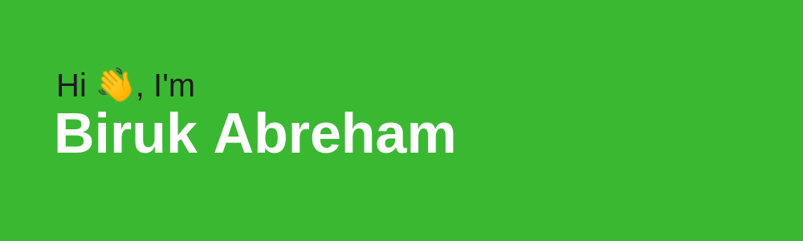

# Hello, folk! 

My name is Biruk Abreham and I'm an enthusiastic full stack developer and apiring to be a senior full stack dev and DevOps engineer. I'm from Ethiopia, and currently working at WebSprix IT Solutions.

## 🔭 Currently Working

- On Ruby on Rails newsletter application
- On my portfolio website

## 🌱 Learning New Skills

- Docker and Infrastructure as a Code
- React.js

📫 You can find me on [Twitter](https://twitter.com/abreham_biruk) and [LinkedIn](https://www.linkedin.com/in/biruk-abraham-3a09a9168/)

<!--
**BirukAbreham/BirukAbreham** is a ✨ _special_ ✨ repository because its `README.md` (this file) appears on your GitHub profile.

Here are some ideas to get you started:

- 🔭 I’m currently working on ...
- 🌱 I’m currently learning ...
- 👯 I’m looking to collaborate on ...
- 🤔 I’m looking for help with ...
- 💬 Ask me about ...
- 📫 How to reach me: ...
- 😄 Pronouns: ...
- ⚡ Fun fact: ...
-->
